# Docker

* Docker学习
  * Docker概述
  * Docker安装
  * Docker命令
    * 镜像命令
    * 容器命令
    * 操作命令
    * ......
  * Docker镜像
  * 数据卷技术
  * DockerFile
  * Docker网络原理
  * IDEA整合Docker
  * Docker Compose
  * Docker Swarm
  * CI/CD   Jenkins


## Docker概述

### Docker为什么会出现

一款产品：开发 ----> 上线  两套环境！应用环境，应用配置！

开发 ---- 运维。问题：程序在我的电脑可以运行！或者版本更新，导致服务不可用！对于运维来说，考验很大！

环境配置时十分麻烦的，集群的话每个机器都要部署环境（集群Redis、ES、Hadoop......），费时费力！

如果我们发布的时候带上环境就能解决上面的问题。比如：（jar +（Redis MySQL jdk ES））

---

传统开发：开发jar，然后运维部署环境和jar包。

现在：开发打包部署上线，一套流程做完！

---

* 类比apk
  * java --- apk --- 发布 --- 应用商店 --- 张三使用apk --- 安装即可
  * java --- jar（自带环境） --- 打包项目带上环境（镜像） --- Docker仓库：商店 --- 下载我们发布的镜像 --- 直接运行即可

---

Docker给以上问题，提出了解决方案：


Docker的思想来自于集装箱！

Docker的核心思想：隔离！

Docker通过隔离机制，可以将服务利用到极致！

---

* 为什么会出现Docker？
  * 所有新技术出现的原因本质是一样的：现实生活中出现了一些问题，我们需要去解决


### Docker的历史

2010年，几个搞IT的年轻人，就在美国成立了一家公司：dotCloud

做一些pass的云计算服务！LXC有关的容器技术！

他们将自己的技术（容器化技术）命名为Docker！

Docker刚刚诞生的时候，没有引起行业的注意！dotCloud，就活不下去！

开源！！！

开放开发源代码，2013年，Docker开源！

越来越多的人发现了Docker的优点！Docker火了，Docker每个月都会更新一个版本！

2014年4月9日，Docker1.0发布！

Docker为什么这么火？十分的轻巧！

在容器技术出现之前，我们都是使用虚拟机技术！

虚拟机：在Windows中安装一个Vmware，通过这个软件我们可以虚拟出一台或者多台电脑！但是很笨重！

虚拟机也属于虚拟化技术。Docker容器技术，也是一种虚拟化技术！

```
vm : linux centos 原生镜像（一个电脑！）隔离，需要开启多个虚拟机！  几个G
docker : 隔离（最核心的内容），十分的小巧，运行镜像就行了！  几个MB
```

---

* 聊聊Docker

  * Docker是基于Go语言开发的！开源项目！

  * 官网：https://www.docker.com/

    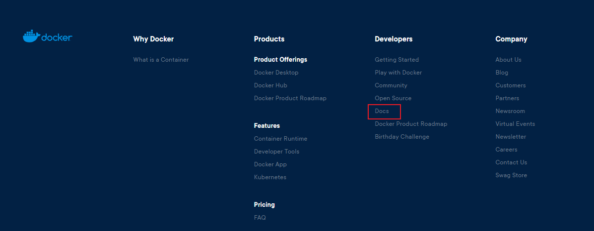

  * 文档地址：https://docs.docker.com/    Docker的文档是超级详细的！

  * 仓库地址：https://hub.docker.com/


### Docker能干嘛

* 之前的虚拟机技术

  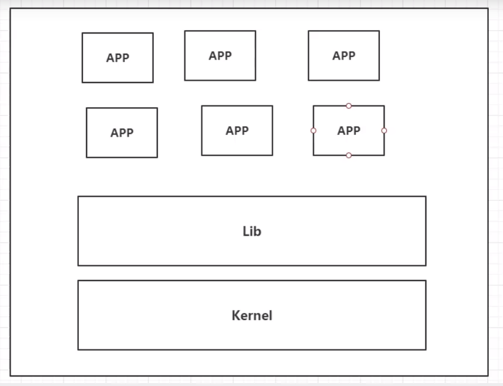

  虚拟机技术缺点：

  1. 资源占用十分多
  2. 冗余步骤多
  3. 启动很慢

  

* 容器化技术

  <font color=red>**容器化技术不是模拟一个完整的操作系统**</font>

  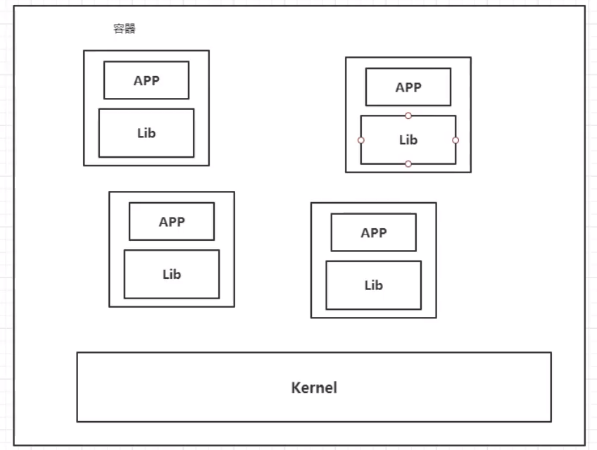

  比较Docker 和 虚拟机技术的不同：

  * 传统虚拟机，虚拟出一套硬件，运行一个完整的操作系统，然后在这个系统上安装和运行软件

  * 容器内的应用直接运行在宿主机的内容，容器是没有自己的内核的，也没有虚拟我们的硬件，所以就轻便了

  * 每个容器之间相互隔离，每个容器内都有一个属于自己的文件系统，互不影响

    

* DevOps（开发、运维）

  **更快的交付和部署**

  传统：一堆帮助文档，安装程序

  Docker：打包镜像发布测试，一键运行

  **更便捷的升级和扩缩容**

  使用了Docker之后，我们部署应用就像搭积木一样！

  项目打包为一个镜像，扩展 服务器A！服务器B！

  **更简单的系统运维**

  在容器化技术之后，我们的开发，测试环境都是高度一致的。

  **更高效的计算资源利用**

  Docker是内核级别的虚拟化，可以在一个物理机上运行很多实例！服务器的性能可以被压榨到极致！


## Docker安装

### Docker的基本组成

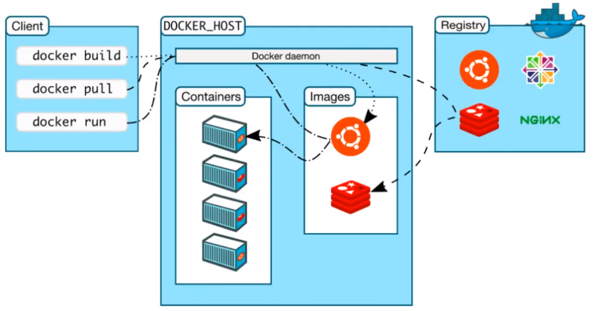

**镜像（image）：**

docker镜像就好比一个模板，可以通过这个模板来创建容器服务，tomcat ---> run ---> tomcat01容器（提供服务器），通过这个镜像可以创建多个容器（最终服务运行或者项目运行就是在容器中的）。

**容器（container）：**

Docker利用容器技术，独立运行一个或者一组应用，通过镜像来创建。

启动，停止，删除，基本命令！

目前就可以把这个容器理解为就是一个简易的linux系统。

****

**仓库（repository）：**

仓库就是存放镜像的地方！仓库分为共有仓库和私有仓库！

Docker Hub（默认是国外的）

阿里云......都有容器服务器（配置镜像加速！）


### 安装Docker

* 环境准备

  1. 需要会一些linux的基础
  2. Centos 7
  3. 使用Xshell连接远程服务操作！

* 环境查看

  ```shell
  # 系统内核
  [root@wxx ~]# uname -r
  3.10.0-693.2.2.el7.x86_64
  ```

  ```shell
  # 系统版本
  [root@wxx ~]# cat /etc/os-release 
  NAME="CentOS Linux"
  VERSION="7 (Core)"
  ID="centos"
  ID_LIKE="rhel fedora"
  VERSION_ID="7"
  PRETTY_NAME="CentOS Linux 7 (Core)"
  ANSI_COLOR="0;31"
  CPE_NAME="cpe:/o:centos:centos:7"
  HOME_URL="https://www.centos.org/"
  BUG_REPORT_URL="https://bugs.centos.org/"
  
  CENTOS_MANTISBT_PROJECT="CentOS-7"
  CENTOS_MANTISBT_PROJECT_VERSION="7"
  REDHAT_SUPPORT_PRODUCT="centos"
  REDHAT_SUPPORT_PRODUCT_VERSION="7"
  ```

* 安装Docker

  ```shell
  # 1.卸载旧的版本
  yum remove docker \
                    docker-client \
                    docker-client-latest \
                    docker-common \
                    docker-latest \
                    docker-latest-logrotate \
                    docker-logrotate \
                    docker-engine
                    
  # 2.安装依赖
  yum install -y yum-utils
  
  # 3.设置镜像仓库
  yum-config-manager \
      --add-repo \
      https://download.docker.com/linux/centos/docker-ce.repo  # 默认是国外的
  
  yum-config-manager \
      --add-repo \
  	http://mirrors.aliyun.com/docker-ce/linux/centos/docker-ce.repo  # 推荐使用阿里云的，比较快
  	
  # 更新yum软件包索引
  yum makecache fast
  
  # 4.安装docker  docker-ce 社区 	ee 企业版
  yum install docker-ce docker-ce-cli containerd.io
  
  # 5.启动docker
  systemctl start docker
  
  # 6.查看docker版本，如下图
  docker version
  ```

  

  ```shell
  # 7.hello-word
  docker run hello-world
  ```

  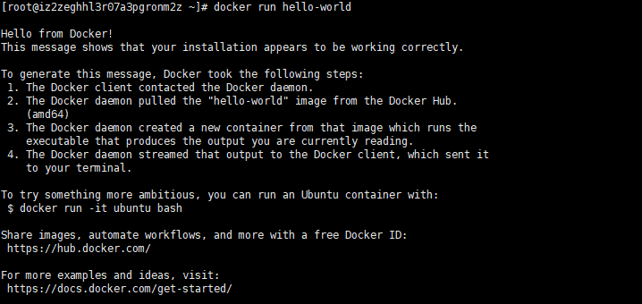

  ```shell
  # 8.查看这个下载的 hello-world镜像
  [root@wxx ~]# docker images
  REPOSITORY          TAG                 IMAGE ID            CREATED             SIZE
  hello-world         latest              bf756fb1ae65        11 months ago       13.3kB
  ```

* 卸载docker

  ```shell
  # 1.卸载依赖
  yum remove docker-ce docker-ce-cli containerd.io
  
  # 2.删除资源
  rm -rf /var/lib/docker
  
  # /var/lib/docker 	docker的默认工作目录！
  ```

  

### 阿里云镜像加速

1.登陆阿里云找到容器服务

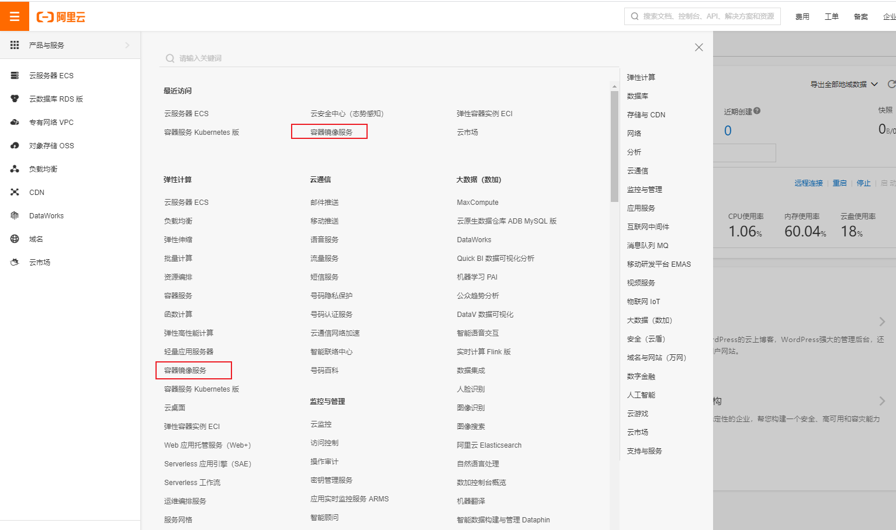

2.找到镜像加速地址

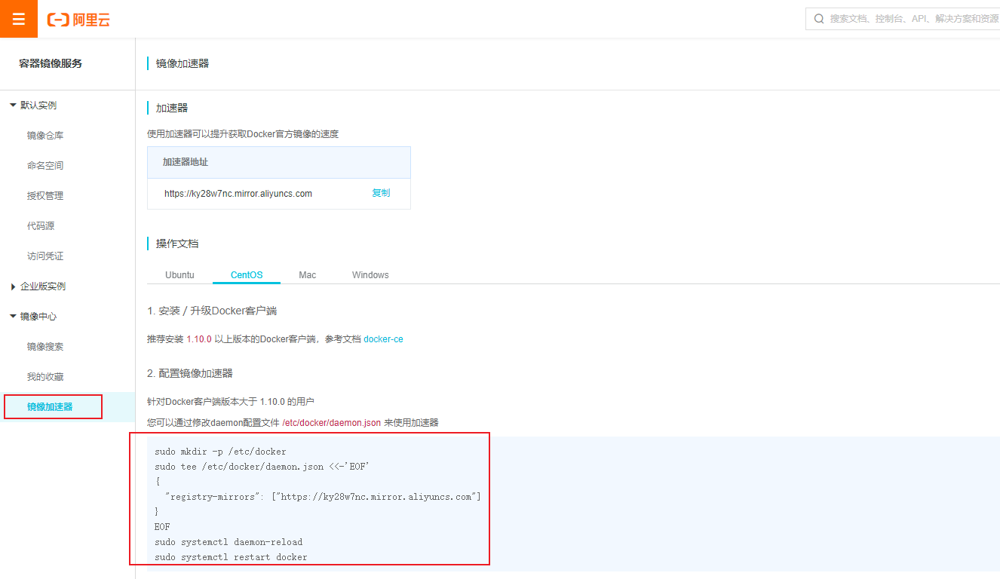

3.配置使用

```shell
sudo mkdir -p /etc/docker

sudo tee /etc/docker/daemon.json <<-'EOF'
{
  "registry-mirrors": ["https://ky28w7nc.mirror.aliyuncs.com"]
}
EOF

sudo systemctl daemon-reload

sudo systemctl restart docker
```


### 回顾hello-world流程

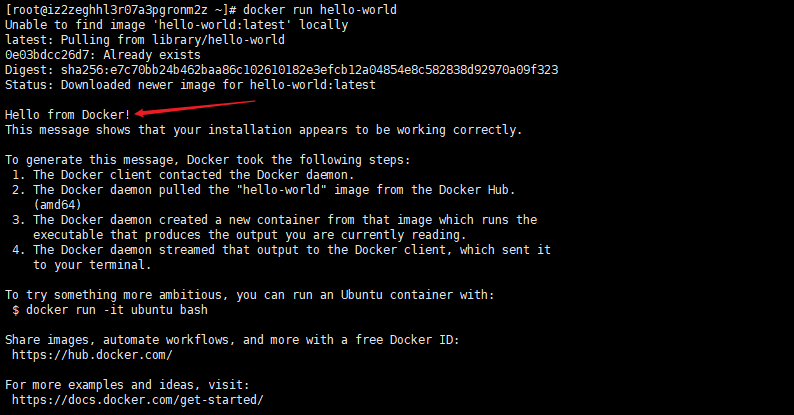

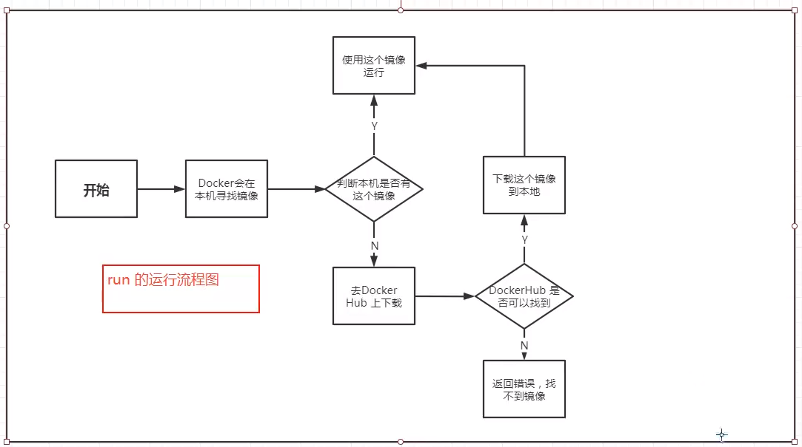


### 底层原理

**Docker是怎样工作的？**

Docker就是一个 Client - Server 结构的系统，Docker的守护京城运行在主机上。通过Socket客户端访问！

DockerServer接收到Docker-Client的指令，就会执行这个命令！


**Docker为什么比VM快？**

1. Docker有着比虚拟机更少的抽象层。
2. Docker利用的是宿主机的内核，VM需要的是Guest OS。

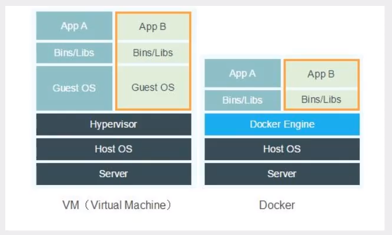

所以说，新建一个容器的时候，docker不需要像虚拟机一样重新加载一个操作系统内核，避免引导。虚拟机加载的是Guest OS，分钟级别的，而docker是利用宿主机的操作系统，省略了这个复杂的过程，秒级！


## Docker的常用命令

### 帮助命令

```shell
docker version 			# 显示docker的版本信息
docker info				# 显示docker的系统信息，包括镜像和容器数量
docker 命令 --help	   # 帮助命令
```

文档帮助地址：https://docs.docker.com/engine/reference/run/


### 镜像命令

**docker images ：**查看所有本地主机的镜像

```shell
[root@wxx ~]# docker images
REPOSITORY          TAG                 IMAGE ID            CREATED             SIZE
wordpress           latest              6edecd0f5c75        3 weeks ago         546MB
mysql               5.7                 1b12f2e9257b        5 weeks ago         448MB
hello-world         latest              bf756fb1ae65        11 months ago       13.3kB

# 解释
REPOSITORY	镜像的仓库源
TAG			镜像的标签
IMAGE ID	镜像的id
CREATED		镜像的创建时间
SIZE		镜像的大小

# 可选项
	-a, --all		# 列出所有的镜像
	-q, --quiet		# 只显示镜像的id
```

**docker search ：**搜索镜像

```shell
[root@wxx ~]# docker search mysql
NAME                              DESCRIPTION                                     STARS               OFFICIAL            AUTOMATED
mysql                             MySQL is a widely used, open-source relation…   10202               [OK]                
mariadb                           MariaDB is a community-developed fork of MyS…   3753                [OK]                
mysql/mysql-server                Optimized MySQL Server Docker images. Create…   746                                     [OK]

# 可选项
	--filter=STARS=3000		# 搜索出来的镜像就是STARS大于3000的
[root@wxx ~]# docker search mysql --filter=STARS=3000
NAME                DESCRIPTION                                     STARS               OFFICIAL            AUTOMATED
mysql               MySQL is a widely used, open-source relation…   10202               [OK]                
mariadb             MariaDB is a community-developed fork of MyS…   3753                [OK]
```

**docker pull ：**下载镜像

```shell
# 下载镜像 docker pull 镜像没[:tag]
[root@wxx ~]# docker pull mysql
Using default tag: latest	# 如果不写tag，默认就是latest
latest: Pulling from library/mysql
852e50cd189d: Pull complete 	# 分层下载，docker image的核心 联合文件系统
29969ddb0ffb: Pull complete 
a43f41a44c48: Pull complete 
5cdd802543a3: Pull complete 
b79b040de953: Pull complete 
938c64119969: Pull complete 
7689ec51a0d9: Pull complete 
a880ba7c411f: Pull complete 
984f656ec6ca: Pull complete 
9f497bce458a: Pull complete 
b9940f97694b: Pull complete 
2f069358dc96: Pull complete 
Digest: sha256:4bb2e81a40e9d0d59bd8e3dc2ba5e1f2197696f6de39a91e90798dd27299b093  # 签名
Status: Downloaded newer image for mysql:latest
docker.io/library/mysql:latest  # 真实状态

# 上面的命令等价于
docker pull docker.io/library/mysql:latest

# 指定版本下载
[root@wxx ~]# docker pull mysql:5.7
5.7: Pulling from library/mysql
852e50cd189d: Already exists 
29969ddb0ffb: Already exists 
a43f41a44c48: Already exists 
5cdd802543a3: Already exists 
b79b040de953: Already exists 
938c64119969: Already exists 
7689ec51a0d9: Already exists 
36bd6224d58f: Pull complete 
cab9d3fa4c8c: Pull complete 
1b741e1c47de: Pull complete 
aac9d11987ac: Pull complete 
Digest: sha256:8e2004f9fe43df06c3030090f593021a5f283d028b5ed5765cc24236c2c4d88e
Status: Downloaded newer image for mysql:5.7
docker.io/library/mysql:5.7
```

**docker rmi ：**删除镜像

```shell
[root@wxx ~]# docker rmi -f 镜像id		# 删除指定的镜像
[root@wxx ~]# docker rmi -f 镜像id 镜像id  # 删除多个镜像
[root@wxx ~]# docker rmi -f $(docker images -aq)  # 删除所有镜像
```


### 容器命令

**说明：有了镜像才可以创建容器，下载一个 centos 镜像来学习**

```shell
docker pull centos
```

**新建容器并启动**

```shell
docker run [可选参数] image

# 参数说明
--name="Name"		# 容器名称
-d					# 后台方式运行
-it					# 使用交互方式运行，进入容器查看内容
-p					# 指定容器的端口	-p 8080:8080
	-p ip:主机端口：容器端口
	-p 主机端口：容器端口（常用）
	-p 容器端口
	容器端口
-p					# 随机指定端口

# 测试，启动并进入容器
[root@wxx ~]# docker run -it centos /bin/bash
[root@6c4df6c7b96b /]# ls  # 查看容器内的centos，基础版本，很多命令都是不完善的
bin  dev  etc  home  lib  lib64  lost+found  media  mnt  opt  proc  root  run  sbin  srv  sys  tmp  usr  var
[root@6c4df6c7b96b /]# exit  # 从容器退回主机
exit
[root@wxx ~]# 
```

**列出所有正在运行的容器**

```shell
docker ps
# 可选项
			# 列出当前正在运行的容器
	-a		# 列出当前正在运行的容器 + 历史运行过的容器
	-n=2	# 列出最近运行的两个容器
	-q		# 只显示容器的编号

[root@wxx ~]# docker ps
CONTAINER ID        IMAGE               COMMAND                  CREATED             STATUS              PORTS                  NAMES

[root@wxx ~]# docker ps -a
CONTAINER ID        IMAGE               COMMAND                  CREATED              STATUS                          PORTS                  NAMES
6c4df6c7b96b        centos              "/bin/bash"              About a minute ago   Exited (0) About a minute ago                          sweet_ptolemy
29b7bb3defa3        hello-world         "/hello"                 52 minutes ago       Exited (0) 52 minutes ago                              distracted_fermat
```

**退出容器**

```shell
exit		# 容器停止并退出
Ctrl+P+Q	# 容器不停止退出
```

**删除容器**

```shell
docker rm 容器id						# 删除指定的容器，不能删除，如果要强制删除 rm -f
docker rm -f $(docker ps -aq)	 	 # 删除所有的容器
docker ps -a -q | xargs docker rm    # 删除所有的容器
```

**启动和停止容器的操作**

```shell
docker start 容器id		# 启动容器
docker restart 容器id		# 重启容器
docker stop 容器id		# 停止当前正在运行的容器
docker kill 容器id		# 强制停止当前容器
```


### 常用的其他命令

**后台启动容器**

```shell
docker run -d 镜像名

[root@wxx ~]# docker run -d centos

# 问题：后台启动容器后，docker ps查看发现 centos 停止了
# 常见的坑：docker容器使用后台运行，如果想不停止的话，就必须有一个前台进程，docker发现没有应用就会自动停止
```

**查看日志**

```shell
docker logs -tf --tail 10 容器id

# 可选项
	-tf				# 显示日志
	--tail number	# 要显示的日志条数

# 自己编写一段shell，测试日志
[root@wxx ~]# docker run -d centos /bin/sh -c "while true;do echo hello;sleep 5;done;"

```

**查看容器中进程信息**

```shell
docker top 容器id

# 测试
[root@wxx ~]# docker top e29cd5069860
UID                 PID                 PPID                C                   STIME  
root                12586               12561               0                   20:59   
root                12789               12586               0                   21:05   
```


**查看容器的元数据**

```shell
docker inspect 容器id

# 测试
[root@wxx ~]# docker inspect e29cd5069860
[
    {
        "Id": "e29cd50698608cf8487902af63aff5c43ea3d9d3291fdb134e0a653bcb671f09",
        "Created": "2020-11-28T12:59:46.777685004Z",
        "Path": "/bin/sh",
        "Args": [
            "-c",
            "while true;do echo hello;sleep 5;done;"
        ],
        "State": {
            "Status": "running",
            "Running": true,
            "Paused": false,
            "Restarting": false,
            "OOMKilled": false,
            "Dead": false,
            "Pid": 12586,
            "ExitCode": 0,
            "Error": "",
            "StartedAt": "2020-11-28T12:59:47.181074506Z",
            "FinishedAt": "0001-01-01T00:00:00Z"
        },
        "Image": "sha256:0d120b6ccaa8c5e149176798b3501d4dd1885f961922497cd0abef155c869566",
        "ResolvConfPath": "/var/lib/docker/containers/e29cd50698608cf8487902af63aff5c43ea3d9d3291fdb134e0a653bcb671f09/resolv.conf",
        "HostnamePath": "/var/lib/docker/containers/e29cd50698608cf8487902af63aff5c43ea3d9d3291fdb134e0a653bcb671f09/hostname",
        "HostsPath": "/var/lib/docker/containers/e29cd50698608cf8487902af63aff5c43ea3d9d3291fdb134e0a653bcb671f09/hosts",
        "LogPath": "/var/lib/docker/containers/e29cd50698608cf8487902af63aff5c43ea3d9d3291fdb134e0a653bcb671f09/e29cd50698608cf8487902af63aff5c43ea3d9d3291fdb134e0a653bcb671f09-json.log",
        "Name": "/distracted_jepsen",
        "RestartCount": 0,
        "Driver": "overlay2",
        "Platform": "linux",
        "MountLabel": "",
        "ProcessLabel": "",
        "AppArmorProfile": "",
        "ExecIDs": null,
        ......
    }
]
```

**进入当前正在运行的容器**

```shell
# 通常容器都是使用后台的方式运行的，需要进入容器，修改一些配置，我们有两种进入容器的方式


# 方式一
docker exec -it 容器id bashShell
# 测试
[root@wxx ~]# docker ps
CONTAINER ID        IMAGE               COMMAND                  CREATED             STATUS              PORTS                  NAMES
e29cd5069860        centos              "/bin/sh -c 'while t…"   13 minutes ago      Up 13 minutes                              distracted_jepsen
1b521b663c6f        centos              "/bin/bash"              39 minutes ago      Up 39 minutes                              kind_gagarin
318144b5a849        wordpress:latest    "docker-entrypoint.s…"   13 days ago         Up 13 days          0.0.0.0:8000->80/tcp   my_wordpress_wordpress_1
7e4806106559        1b12f2e9257b        "docker-entrypoint.s…"   13 days ago         Up 13 days          3306/tcp, 33060/tcp    my_wordpress_db_1
[root@wxx ~]# docker exec -it e29cd5069860 /bin/bash
[root@e29cd5069860 /]# ps -ef
UID        PID  PPID  C STIME TTY          TIME CMD
root         1     0  0 12:59 ?        00:00:00 /bin/sh -c while true;do echo hello;sleep 5;done;
root       191     1  0 13:13 ?        00:00:00 /usr/bin/coreutils --coreutils-prog-shebang=sleep /usr/bin/sleep 5
root       192     0  0 13:13 pts/0    00:00:00 /bin/bash
root       205   192  0 13:13 pts/0    00:00:00 ps -ef

# 方式二
docker attach 容器id
# 测试
[root@wxx ~]# docker attach e29cd5069860
hello
hello

# docker exec			# 进入容器后开启一个新的终端，可以在里面操作
# docker attach			# 进入容器正在执行的终端，不会启动新的进程
```

**从容器内拷贝文件到主机上**

```shell
# 创建容器并进入容器命令行
[root@wxx home]# docker run -it --name="mycentos" centos /bin/bash
[root@8017e6a7d86d /]# ls
bin  dev  etc  home  lib  lib64  lost+found  media  mnt  opt  proc  root  run  sbin  srv  sys  tmp  usr  var
[root@8017e6a7d86d /]# cd home/
# 在容器内新建文件
[root@8017e6a7d86d home]# touch test.java
[root@8017e6a7d86d home]# ls
test.java
[root@8017e6a7d86d home]# exit
exit
# 将文件拷贝到主机上，容器停止也可以拷贝，可以通过 docker ps -a 查看历史容器
[root@wxx home]# docker cp 8017e6a7d86d:/home/test.java /home
[root@wxx home]# ls
my_wordpress  redis  test.java  www
```


### 小结

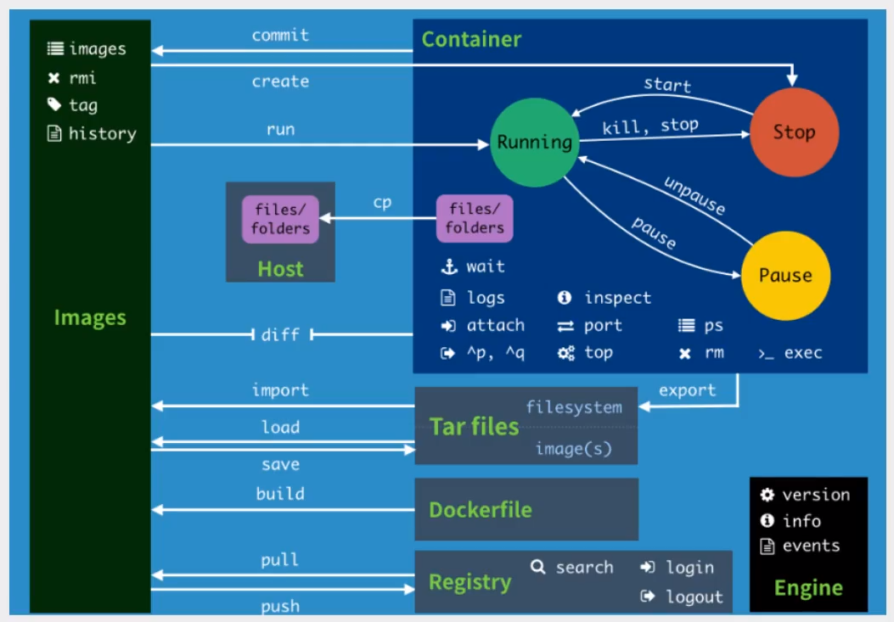