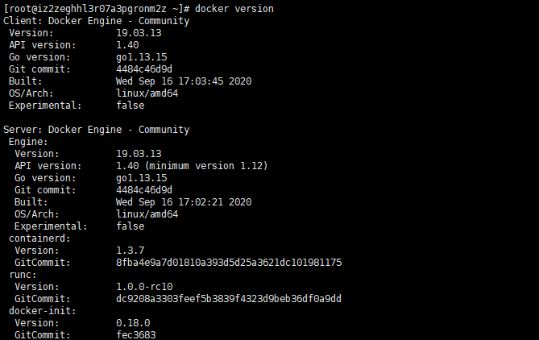
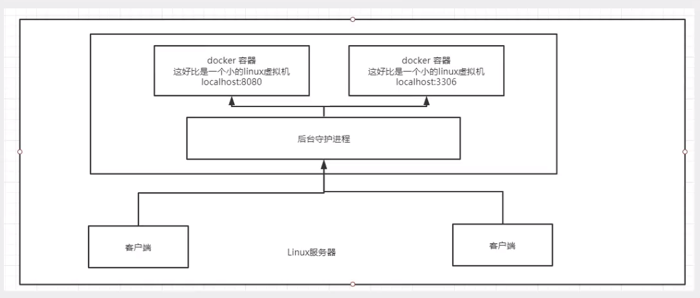

# Docker

* Docker学习
  * Docker概述
  * Docker安装
  * Docker命令
    * 镜像命令
    * 容器命令
    * 操作命令
    * ......
  * Docker镜像
  * 数据卷技术
  * DockerFile
  * Docker网络原理
  * IDEA整合Docker
  * Docker Compose
  * Docker Swarm
  * CI/CD   Jenkins


## Docker概述

### Docker为什么会出现

一款产品：开发 ----> 上线  两套环境！应用环境，应用配置！

开发 ---- 运维。问题：程序在我的电脑可以运行！或者版本更新，导致服务不可用！对于运维来说，考验很大！

环境配置时十分麻烦的，集群的话每个机器都要部署环境（集群Redis、ES、Hadoop......），费时费力！

如果我们发布的时候带上环境就能解决上面的问题。比如：（jar +（Redis MySQL jdk ES））

---

传统开发：开发jar，然后运维部署环境和jar包。

现在：开发打包部署上线，一套流程做完！

---

* 类比apk
  * java --- apk --- 发布 --- 应用商店 --- 张三使用apk --- 安装即可
  * java --- jar（自带环境） --- 打包项目带上环境（镜像） --- Docker仓库：商店 --- 下载我们发布的镜像 --- 直接运行即可

---

Docker给以上问题，提出了解决方案：


Docker的思想来自于集装箱！

Docker的核心思想：隔离！

Docker通过隔离机制，可以将服务利用到极致！

---

* 为什么会出现Docker？
  * 所有新技术出现的原因本质是一样的：现实生活中出现了一些问题，我们需要去解决


### Docker的历史

2010年，几个搞IT的年轻人，就在美国成立了一家公司：dotCloud

做一些pass的云计算服务！LXC有关的容器技术！

他们将自己的技术（容器化技术）命名为Docker！

Docker刚刚诞生的时候，没有引起行业的注意！dotCloud，就活不下去！

开源！！！

开放开发源代码，2013年，Docker开源！

越来越多的人发现了Docker的优点！Docker火了，Docker每个月都会更新一个版本！

2014年4月9日，Docker1.0发布！

Docker为什么这么火？十分的轻巧！

在容器技术出现之前，我们都是使用虚拟机技术！

虚拟机：在Windows中安装一个Vmware，通过这个软件我们可以虚拟出一台或者多台电脑！但是很笨重！

虚拟机也属于虚拟化技术。Docker容器技术，也是一种虚拟化技术！

```
vm : linux centos 原生镜像（一个电脑！）隔离，需要开启多个虚拟机！  几个G
docker : 隔离（最核心的内容），十分的小巧，运行镜像就行了！  几个MB
```

---

* 聊聊Docker

  * Docker是基于Go语言开发的！开源项目！

  * 官网：https://www.docker.com/

    

  * 文档地址：https://docs.docker.com/    Docker的文档是超级详细的！

  * 仓库地址：https://hub.docker.com/


### Docker能干嘛

* 之前的虚拟机技术

  

  虚拟机技术缺点：

  1. 资源占用十分多
  2. 冗余步骤多
  3. 启动很慢

  

* 容器化技术

  <font color=red>**容器化技术不是模拟一个完整的操作系统**</font>

  

  比较Docker 和 虚拟机技术的不同：

  * 传统虚拟机，虚拟出一套硬件，运行一个完整的操作系统，然后在这个系统上安装和运行软件

  * 容器内的应用直接运行在宿主机的内容，容器是没有自己的内核的，也没有虚拟我们的硬件，所以就轻便了

  * 每个容器之间相互隔离，每个容器内都有一个属于自己的文件系统，互不影响

    

* DevOps（开发、运维）

  **更快的交付和部署**

  传统：一堆帮助文档，安装程序

  Docker：打包镜像发布测试，一键运行

  **更便捷的升级和扩缩容**

  使用了Docker之后，我们部署应用就像搭积木一样！

  项目打包为一个镜像，扩展 服务器A！服务器B！

  **更简单的系统运维**

  在容器化技术之后，我们的开发，测试环境都是高度一致的。

  **更高效的计算资源利用**

  Docker是内核级别的虚拟化，可以在一个物理机上运行很多实例！服务器的性能可以被压榨到极致！


## Docker安装

### Docker的基本组成


**镜像（image）：**

docker镜像就好比一个模板，可以通过这个模板来创建容器服务，tomcat ---> run ---> tomcat01容器（提供服务器），通过这个镜像可以创建多个容器（最终服务运行或者项目运行就是在容器中的）。

**容器（container）：**

Docker利用容器技术，独立运行一个或者一组应用，通过镜像来创建。

启动，停止，删除，基本命令！

目前就可以把这个容器理解为就是一个简易的linux系统。

****

**仓库（repository）：**

仓库就是存放镜像的地方！仓库分为共有仓库和私有仓库！

Docker Hub（默认是国外的）

阿里云......都有容器服务器（配置镜像加速！）


### 安装Docker

* 环境准备

  1. 需要会一些linux的基础
  2. Centos 7
  3. 使用Xshell连接远程服务操作！

* 环境查看

  ```shell
  # 系统内核
  [root@iz2zeghhl3r07a3pgronm2z ~]# uname -r
  3.10.0-693.2.2.el7.x86_64
  ```

  ```shell
  # 系统版本
  [root@iz2zeghhl3r07a3pgronm2z ~]# cat /etc/os-release 
  NAME="CentOS Linux"
  VERSION="7 (Core)"
  ID="centos"
  ID_LIKE="rhel fedora"
  VERSION_ID="7"
  PRETTY_NAME="CentOS Linux 7 (Core)"
  ANSI_COLOR="0;31"
  CPE_NAME="cpe:/o:centos:centos:7"
  HOME_URL="https://www.centos.org/"
  BUG_REPORT_URL="https://bugs.centos.org/"
  
  CENTOS_MANTISBT_PROJECT="CentOS-7"
  CENTOS_MANTISBT_PROJECT_VERSION="7"
  REDHAT_SUPPORT_PRODUCT="centos"
  REDHAT_SUPPORT_PRODUCT_VERSION="7"
  ```

* 安装Docker

  ```shell
  # 1.卸载旧的版本
  yum remove docker \
                    docker-client \
                    docker-client-latest \
                    docker-common \
                    docker-latest \
                    docker-latest-logrotate \
                    docker-logrotate \
                    docker-engine
                    
  # 2.安装依赖
  yum install -y yum-utils
  
  # 3.设置镜像仓库
  yum-config-manager \
      --add-repo \
      https://download.docker.com/linux/centos/docker-ce.repo  # 默认是国外的
  
  yum-config-manager \
      --add-repo \
  	http://mirrors.aliyun.com/docker-ce/linux/centos/docker-ce.repo  # 推荐使用阿里云的，比较快
  	
  # 更新yum软件包索引
  yum makecache fast
  
  # 4.安装docker  docker-ce 社区 	ee 企业版
  yum install docker-ce docker-ce-cli containerd.io
  
  # 5.启动docker
  systemctl start docker
  
  # 6.查看docker版本，如下图
  docker version
  ```

  

  ```shell
  # 7.hello-word
  docker run hello-world
  ```

  

  ```shell
  # 8.查看这个下载的 hello-world镜像
  [root@iz2zeghhl3r07a3pgronm2z ~]# docker images
  REPOSITORY          TAG                 IMAGE ID            CREATED             SIZE
  hello-world         latest              bf756fb1ae65        11 months ago       13.3kB
  ```

* 卸载docker

  ```shell
  # 1.卸载依赖
  yum remove docker-ce docker-ce-cli containerd.io
  
  # 2.删除资源
  rm -rf /var/lib/docker
  
  # /var/lib/docker 	docker的默认工作目录！
  ```

  

### 阿里云镜像加速

1.登陆阿里云找到容器服务


2.找到镜像加速地址


3.配置使用

```shell
sudo mkdir -p /etc/docker

sudo tee /etc/docker/daemon.json <<-'EOF'
{
  "registry-mirrors": ["https://ky28w7nc.mirror.aliyuncs.com"]
}
EOF

sudo systemctl daemon-reload

sudo systemctl restart docker
```


### 回顾hello-world流程


### 底层原理

**Docker是怎样工作的？**

Docker就是一个 Client - Server 结构的系统，Docker的守护京城运行在主机上。通过Socket客户端访问！

DockerServer接收到Docker-Client的指令，就会执行这个命令！



**Docker为什么比VM快？**

1. Docker有着比虚拟机更少的抽象层。
2. Docker利用的是宿主机的内核，VM需要的是Guest OS。


所以说，新建一个容器的时候，docker不需要像虚拟机一样重新加载一个操作系统内核，避免引导。虚拟机加载的是Guest OS，分钟级别的，而docker是利用宿主机的操作系统，省略了这个复杂的过程，秒级！

